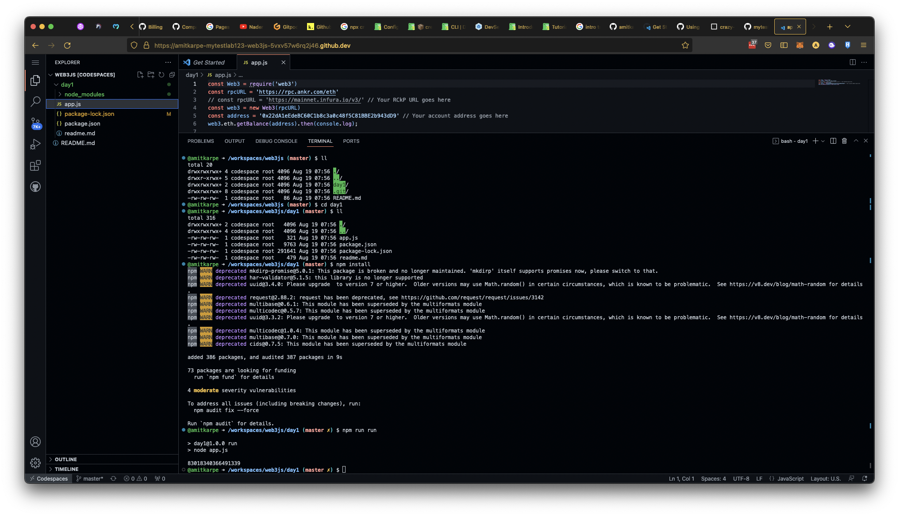
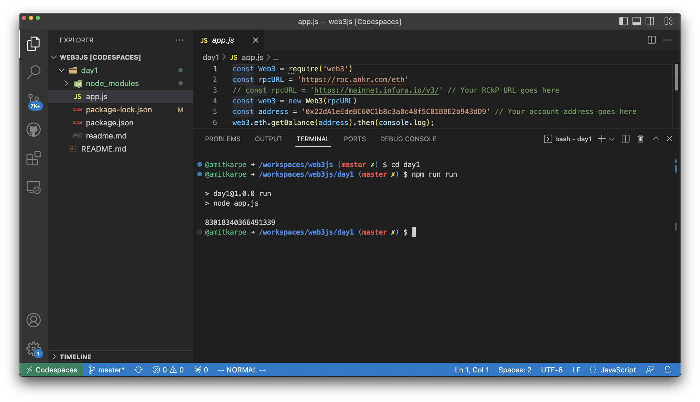

# Codespaces
#### use GitHub Codespaces, if user don't want to setup npm/node on local system.

:::tip GitHub Codespaces - cloud developer environments


When using *GitHub Codespaces*, user don't have to setup anything on thee local system/desktop. This provides a virtual machine with pre-configure environment.
User should create github account and use GitHub Codespaces anytime.

:::
## Open repo with GitHub Codespaces

e.g. https://github.com/mytestlab123/web3js

or
https://github.com/mytestlab123/web3js/codespaces

* Either open it in browser or in VS Code IDE.
* Using terminal run following commands:

```shell
# changed into "day1" directory
cd day1

# install required packages for app
npm install

# run app with following command
npm run run
```

* You should see similar output:

```
@amitkarpe ➜ /workspaces/web3js (master) $ cd day1
@amitkarpe ➜ /workspaces/web3js/day1 (master) $ ll
total 316
drwxrwxrwx+ 2 codespace root   4096 Aug 19 07:56 ./
drwxrwxrwx+ 4 codespace root   4096 Aug 19 07:56 ../
-rw-rw-rw-  1 codespace root    321 Aug 19 07:56 app.js
-rw-rw-rw-  1 codespace root   9763 Aug 19 07:56 package.json
-rw-rw-rw-  1 codespace root 291641 Aug 19 07:56 package-lock.json
-rw-rw-rw-  1 codespace root    479 Aug 19 07:56 readme.md
@amitkarpe ➜ /workspaces/web3js/day1 (master) $ npm install
npm WARN deprecated mkdirp-promise@5.0.1: This package is broken and no longer maintained. 'mkdirp' itself supports promises now, please switch to that.
npm WARN deprecated har-validator@5.1.5: this library is no longer supported
npm WARN deprecated uuid@3.4.0: Please upgrade  to version 7 or higher.  Older versions may use Math.random() in certain circumstances, which is known to be problematic.  See https://v8.dev/blog/math-random for details.
npm WARN deprecated request@2.88.2: request has been deprecated, see https://github.com/request/request/issues/3142
npm WARN deprecated multibase@0.6.1: This module has been superseded by the multiformats module
npm WARN deprecated multicodec@0.5.7: This module has been superseded by the multiformats module
npm WARN deprecated uuid@3.3.2: Please upgrade  to version 7 or higher.  Older versions may use Math.random() in certain circumstances, which is known to be problematic.  See https://v8.dev/blog/math-random for details.
npm WARN deprecated multicodec@1.0.4: This module has been superseded by the multiformats module
npm WARN deprecated multibase@0.7.0: This module has been superseded by the multiformats module
npm WARN deprecated cids@0.7.5: This module has been superseded by the multiformats module

added 386 packages, and audited 387 packages in 9s

73 packages are looking for funding
  run `npm fund` for details

4 moderate severity vulnerabilities

To address all issues (including breaking changes), run:
  npm audit fix --force

Run `npm audit` for details.
@amitkarpe ➜ /workspaces/web3js/day1 (master ✗) $ npm run run

> day1@1.0.0 run
> node app.js

83018340366491339
```

* These screenshot might help, to understand the process, else please check [docs](https://docs.github.com/en/codespaces)

* **On GitHub Codespaces** 
  
  
* **GitHub Codespaces in VS Code** 
  

* **GitHub Codespaces in Browser** 
  
